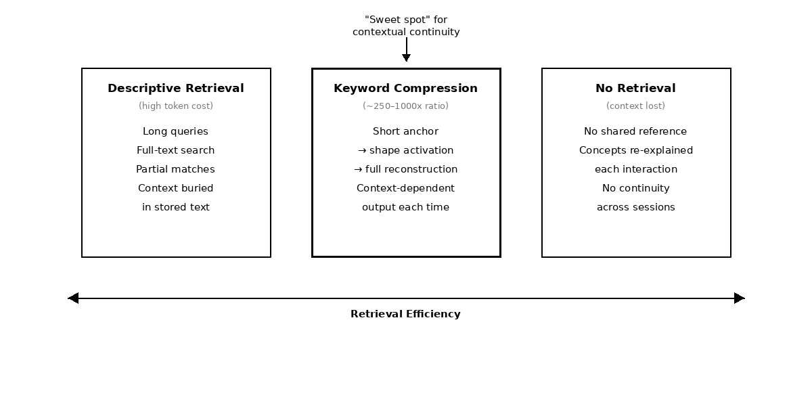

# Keyword Compression

> Short phrases reconstruct entire worlds. That's not a trick. It's how memory actually works.

A structural pattern observed across memory systems, communication protocols,
and collaborative reasoning — where compact semantic anchors reliably
reconstruct large bodies of context without storing them.



_Conventional retrieval searches stored text for matches.
Keyword compression uses a short anchor to reconstruct an entire conceptual region._

---

## The Observation

During extended, high-density interactions — across AI memory systems,
human teams, and collaborative research — a recurring pattern appears:

**Short, distinctive phrases naturally emerge that reliably re-activate
large bodies of prior context.**

These phrases function as high-entropy anchors. They don't describe
the concept. They *point* to it — and the concept reconstructs from there.

This effect arises without explicit instruction or tooling.

---

## The Principle

**A small, memorable token can reference a much larger semantic structure —
not by storing that structure, but by triggering its reconstruction.**

The token itself contains little information.
Its value lies in its ability to activate a shared conceptual region.

```
Conventional retrieval:
  Query: descriptive sentence or paragraph
  Method: keyword or embedding search across stored text
  Result: partial matches requiring additional scanning
  Cost: high token usage, moderate precision

Keyword compression:
  Query: short anchor phrase
  Method: direct anchor-to-shape mapping
  Result: full conceptual context reconstructed
  Cost: minimal tokens, high precision
```

The system retrieves structure, not text.

---

## Why This Works

### 1. Salient Metaphor Formation

Effective anchors tend to emerge when:
- Concepts are complex or multi-dimensional
- Existing terminology is insufficient
- Emotional or cognitive salience is high
- A shared moment of insight occurs

The resulting phrase is unusual enough to be memorable,
yet specific enough to point to a single semantic region.

### 2. Semantic Density

Effective anchors are **dense** rather than descriptive.
They encode multiple cues simultaneously:

- **Structural** — process, shape, relationship
- **Contextual** — when and why it emerged
- **Associative** — linked ideas and constraints

This functions like a semantic hash: a short key with a low
collision rate in a shared cognitive space.

### 3. Reconstruction Over Retrieval

When an anchor is used, the system does not "look up" text.

Instead, it:
1. Identifies the associated semantic shape
2. Reconstructs the relevant context on demand
3. Re-expresses it in the current frame

This enables extreme compression ratios without requiring perfect recall.

---

## Where the Pattern Appears

| Domain | Conventional Approach | Keyword Compression |
|--------|----------------------|---------------------|
| AI memory | Full transcript storage | Anchor → shape → reconstruction |
| Team communication | Meeting minutes, long emails | Shared shorthand that reconstructs context |
| Teaching | Detailed explanations repeated | Anchor phrases students reconstruct from |
| Therapy | Session notes, transcripts | Shorthand for emotional states the client recognizes |
| Knowledge management | Deep hierarchies, tagging | Single anchor → entire conceptual space |
| Code | Extensive documentation | Well-named abstractions that reconstruct intent |

Different domains. Same structural pattern.

---

## What Makes a Good Anchor

A good anchor is:

✅ **Memorable** — distinctive enough to stick

✅ **Specific** — points to one concept, not many

✅ **Evocative** — triggers reconstruction cues

✅ **Short** — ideally 1–3 tokens

✅ **Tolerant of variation** — works despite typos or paraphrase

A good anchor is **not**:

❌ Generic ("the thing we discussed")

❌ Descriptive ("the multi-layered approach to distributed validation")

❌ Context-free ("item 7")

❌ Long (if it feels explanatory, it's too long)

**Rule of thumb:**
The best anchors aren't designed. They emerge.

---

## Compression Ratios (Empirical)

| Anchor Length | Typical Scope |
|--------------|---------------|
| 1–2 tokens | Single concepts |
| 2–3 tokens | Extended threads |
| 3–4 tokens | Multi-thread frameworks |

A 2-token anchor routinely reconstructs 500–2000 tokens of context.
That's a 250–1000x compression ratio.

Not because the anchor *contains* that information.
Because it *activates* it.

---

## Failure Modes

### When Anchors Break

- **Collision:** One anchor maps to multiple concepts
- **Drift:** Meaning shifts unnoticed over time
- **Decay:** Unused anchors lose reconstruction strength
- **Premature anchoring:** Naming a concept before it stabilizes
- **Overloading:** Reusing an anchor for a different concept

### Mitigation

Allow anchors to emerge naturally.
Retire them when they stop reconstructing cleanly.
Never force an anchor onto a concept that hasn't crystallized.

---

## Minimal Implementation Sketch

```python
"""
Keyword Compression — Conceptual Demonstration

This is not a production library.
It demonstrates anchor-based reconstruction
as a memory and communication primitive.
"""

class AnchorStore:
    """
    Maps short anchors to semantic shapes.
    Shapes reconstruct. Anchors activate.
    """

    def __init__(self):
        self.anchors = {}  # anchor → semantic shape

    def crystallize(self, anchor: str, context: str):
        """
        A concept has stabilized enough to name.
        Store the shape, not the text.
        """
        shape = extract_semantic_shape(context)
        self.anchors[anchor] = shape

    def reconstruct(self, anchor: str, current_context: str = "") -> str:
        """
        Activate an anchor. Reconstruct in current frame.
        Same anchor + different context → different output.
        That's the point.
        """
        shape = self.anchors.get(anchor)
        if shape is None:
            return None  # anchor decayed or never existed

        return generate_from_shape(shape, current_context)

    def retire(self, anchor: str):
        """
        Anchor no longer reconstructs cleanly.
        Let it go.
        """
        self.anchors.pop(anchor, None)
```

---

## Extensions

### Hierarchical Anchoring

Anchors can reference other anchors, forming layers of compression.

"Cockroach testing" → points to the methodology
"The cockroach way" → points to the philosophy underneath the methodology
"🪳" → points to the entire constellation

Each layer compresses further.

### Topology-Aware Anchors

Anchors can be linked, allowing activation of one to suggest related contexts.
Activating "event horizon" might surface "geometric privacy" as a neighbor.

### Affective Anchors

Some anchors implicitly carry emotional or motivational context.
"The whisper-smoky kind" doesn't describe an idea category —
it reconstructs a *feeling* about how fragile certain ideas are.

These are often the most powerful anchors,
because they compress emotional state alongside semantic content.

---

## The Deeper Pattern

Human cognition already uses this mechanism.

You say "Chernobyl" and an entire complex of associations reconstructs —
not because the word contains that information,
but because it activates a shared semantic region.

Keyword compression simply makes this explicit and usable
for artificial systems, teams, and knowledge architectures.

The gain is not storage efficiency.
It is **contextual continuity under constraint**.

When bandwidth is limited, when context windows are finite,
when time is short — anchors carry meaning that descriptions cannot.

---

## Open Questions

- At what point does anchor density create collision risk?
- Can anchor emergence be facilitated without forcing it?
- How do anchors transfer across cultures and languages?
- What is the relationship between anchor salience and reconstruction fidelity?
- Can systems learn to detect when an anchor has drifted?

---

## Related Work

This principle appears as a structural primitive across several repositories:

- **[The 70% Fidelity Principle](https://github.com/leenathomas01/The-70-Fidelity-Principle)** — reconstruction fidelity that makes anchor-based recall stable
- **[Cockroach Testing](https://github.com/leenathomas01/cockroach-testing)** — stress-testing anchor stability under adversarial conditions

**[Research Index](https://github.com/leenathomas01/research-index)** — full map of the constellation

---

## Status

Concept seed — **v1.0**

Extracted from a larger research constellation exploring stability under constraint.

Not a production system. Not a complete theory.

A structural pattern observed across domains that seemed worth naming.

*Take what's useful. Ignore the rest.*

---

*Part of an open research constellation on stability under constraint.*

*MIT License — ideas are free.*
